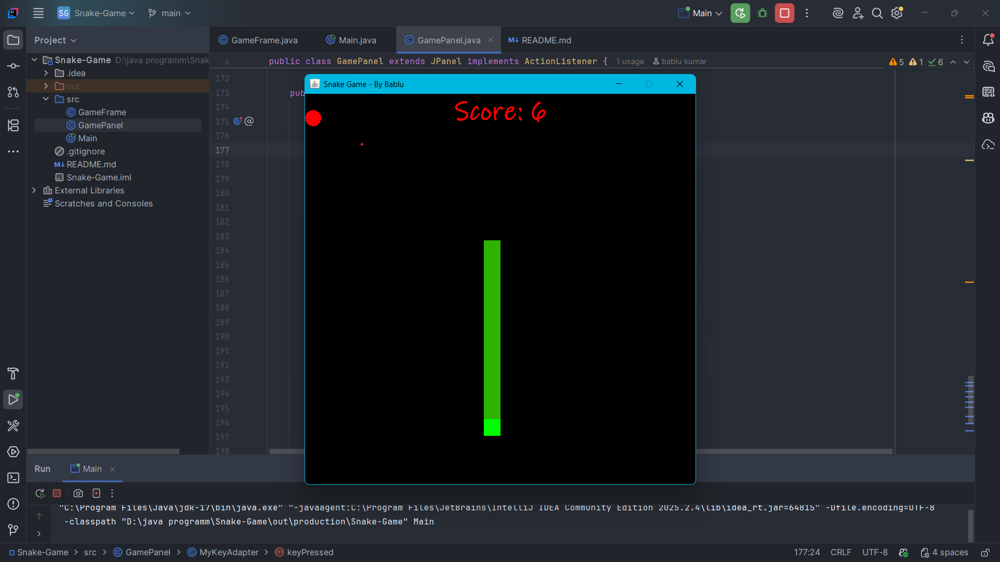

# 🐍 Classic Snake Game (Java)

A classic Snake Game built from scratch using **Core Java (Swing & AWT)**.
The goal of this project is to understand game loops, rendering, and event handling without using any external game engine.

## 🎮 Key Features
- **Smooth Controls:** Lag-free snake movement using KeyAdapter.
- **Dynamic Speed Control:**
    - Press `1`: Slow Speed
    - Press `2`: Normal Speed
    - Press `3`: Fast Speed ⚡
- **Restart Mechanism:** Press `SPACE` to restart instantly after Game Over.
- **Score System:** Real-time score tracking.
- **Smart Rendering:** Custom `paintComponent` rendering for smooth graphics.

## 🛠️ Tech Stack
- **Language:** Java (JDK 17+)
- **GUI:** Swing & AWT (JPanel, JFrame, Graphics)
- **Logic:** OOPs, Multithreading (Timer), 2D Arrays, Event Handling

## 🚀 Roadmap & Progress
We successfully completed the project in 2 Days!

- [x] **Day 1:** Project Setup (JFrame, JPanel) & Grid Logic
- [x] **Day 2:** Snake Body & Movement Logic
- [x] **Day 2:** Food Generation & Collision Detection
- [x] **Day 2:** Score System & Game Over Screen
- [x] **Day 2 (Bonus):** Added Restart Functionality & Speed Controls

## 📸 Screenshots

## ⚙️ How to Run
1. Clone this repository.
2. Open the folder in VS Code or IntelliJ IDEA.
3. Run the `Main.java` file.
4. **Controls:**
    - Arrow Keys to Move.
    - `1`, `2`, `3` to change speed.
    - `SPACE` to Restart.

## 👨‍💻 Author
**Bablu Kumar** - *Aspiring Backend Developer*